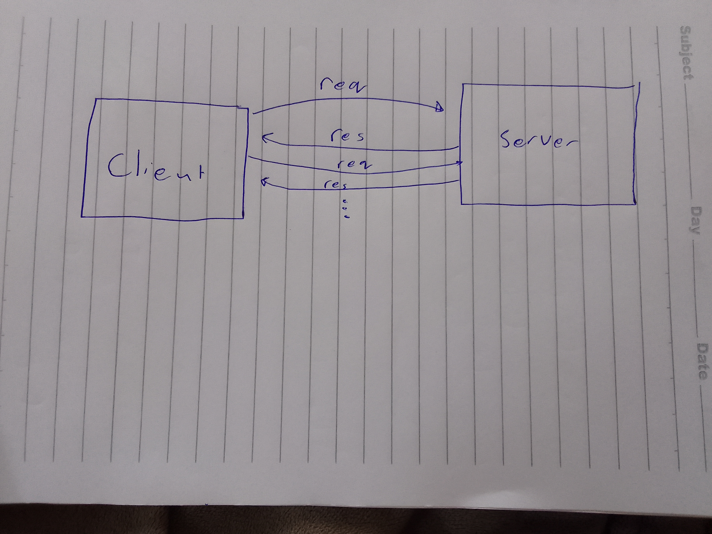

# Movies-Library
# Project Name - MOVIES-LIBRARY

# Lab14 - Using API

**Author Name**: Ala' AbuSalem

## WRRC

## Overview

## Getting Started
1.Creat a Repository and clone it.

2.touch server.js

3.npm init -y

3.npm install express

4.`server.listen....`

5.npm start to start the server

## Project Features
practice  Node.js